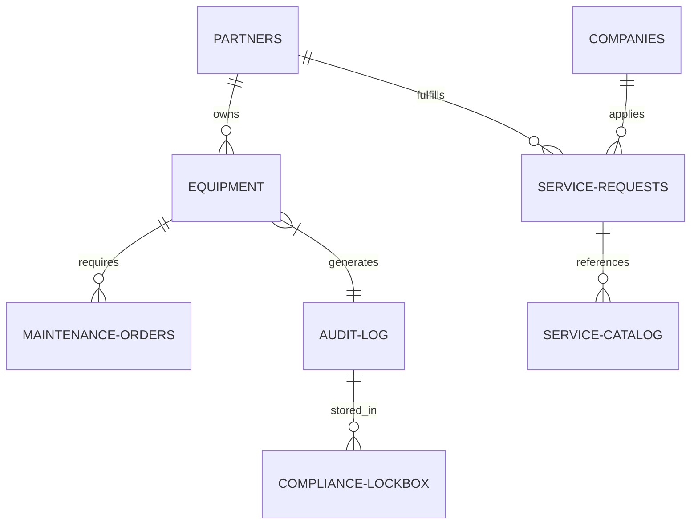
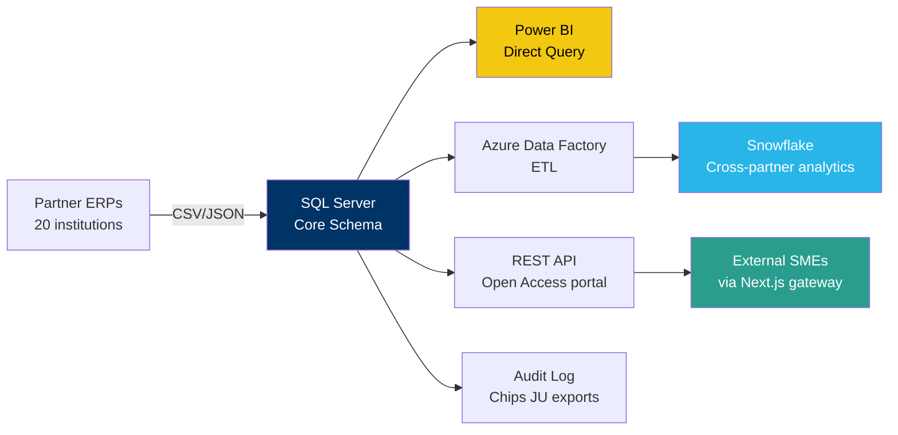

# PIXEurope Pilot Line — Data Platform

> **Production-ready SQL Server / T-SQL data platform** for managing equipment, procurement, open-access services, and EU compliance across a 20-partner consortium spanning 11 countries.

<div align="center">

[](https://www.microsoft.com/en-us/sql-server)
[](#)
[](#)
[](#)
[](#license)

</div>

---

## Overview

The **PIXEurope Pilot Line** is a €400M EU initiative under the **Chips Joint Undertaking** to build photonic integrated circuit (PIC) manufacturing infrastructure across Europe. This repository contains the complete data platform design — schemas, views, stored procedures, audit triggers, and reporting layer — built in **SQL Server with T-SQL**.

The platform was designed against the published Data & Gateway Officer role specification and serves as a working reference architecture for any large-scale, multi-partner, EU-funded research consortium needing **FAIR-compliant data governance**, **GDPR audit trails**, and **automated Chips JU financial reporting**.

### What this platform does

|     | Capability | How |
| --- | ---------- | --- |
| **🏭** | Tracks every piece of equipment across all 20 partner sites | `Core.Equipment` with audit trigger captures every state change |
| **🌐** | Manages external-company access through an Open Access gateway | `Gateway` schema — CRM, service catalog, request lifecycle |
| **📊** | Generates Chips JU monthly financial reports automatically | `usp_GenerateChipsJUFinancialReport` — one call, three result sets |
| **🛡️** | Enforces GDPR 30-day response compliance | `Compliance` schema with computed deadline column and dashboard |
| **🔍** | Provides EU-grade audit traceability on every data change | `trg_Equipment_Audit` writes JSON before/after to `AuditLog` |
| **📈** | Powers real-time stakeholder dashboards in Power BI | 5 read-only views in the `BI` schema |

---

## Architecture


  
# Database ERD



  <p><em>Entity Relationship Diagram — 12 tables across 4 schemas, with full T-SQL programmability layer</em></p>


### Schema design philosophy

The platform is organized into four schemas, each with a distinct ownership boundary and access control profile:

```
┌──────────────────────────────────────────────────────────────────────┐
│  CORE        │  Internal Pilot Line operations                        │
│              │  Partners · Equipment · WorkOrders · Procurement       │
├──────────────┼────────────────────────────────────────────────────────┤
│  GATEWAY     │  External Open Access (CRM)                            │
│              │  Companies · ServiceCatalog · ServiceRequests          │
├──────────────┼────────────────────────────────────────────────────────┤
│  COMPLIANCE  │  Audit trail · GDPR · FAIR data tracking               │
│              │  AuditLog · GDPRRequests · DMPMilestones               │
├──────────────┼────────────────────────────────────────────────────────┤
│  BI          │  Read-only stakeholder views (Power BI direct query)   │
│              │  5 reporting views — Director · Finance · DPO · Board  │
└──────────────┴────────────────────────────────────────────────────────┘
```

This separation enables **role-based access control**: the Open Access Manager gets read/write on `Gateway` only, the Financial Manager gets `Core` + `Compliance` read-only, and Chips JU auditors can be granted read-only access to `Compliance` without ever seeing operational data.

---

## Tech Stack

<table>
  <thead>
    <tr>
      <th align="left">Layer</th>
      <th align="left">Technology</th>
      <th align="left">Purpose</th>
    </tr>
  </thead>
  <tbody>
    <tr>
      <td><strong>Database</strong></td>
      <td> Microsoft SQL Server 2019+</td>
      <td>Primary OLTP store with full ACID compliance, schemas, and built-in security model</td>
    </tr>
    <tr>
      <td><strong>Query Language</strong></td>
      <td> T-SQL</td>
      <td>Stored procedures, triggers, computed columns, JSON functions, transactions</td>
    </tr>
    <tr>
      <td><strong>BI / Visualization</strong></td>
      <td> Power BI</td>
      <td>Direct Query connection to <code>BI</code> schema views — auto-refreshing dashboards</td>
    </tr>
    <tr>
      <td><strong>Development</strong></td>
      <td> Azure Data Studio</td>
      <td>Cross-platform SQL editor with Git integration</td>
    </tr>
    <tr>
      <td><strong>Version Control</strong></td>
      <td> Git + GitHub</td>
      <td>Full schema versioning, migration history, code review workflow</td>
    </tr>
    <tr>
      <td><strong>Compliance</strong></td>
      <td>Chips JU · GDPR · FAIR Data</td>
      <td>EU regulatory frameworks for research data, personal data, and open science</td>
    </tr>
  </tbody>
</table>

### Modern integration points

Although the core platform is built on SQL Server, it is designed to integrate cleanly with the modern data ecosystem:



---

## Repository Structure

```
pixeurope-data-platform/
├── 01_schema_and_setup.sql          # Core schemas, all 12 tables, constraints
├── 02_data_triggers_indexes.sql     # Sample data, audit trigger, 6 indexes
├── 03_views_stored_procedures.sql   # 5 BI views, 3 stored procedures
├── 04_practice_exercises.sql        # 9 guided queries with talking points
│
├── readme_assets/
│   └── erd.png                      # Schema diagram (this README's hero image)
│
└── README.md                        # You are here
```

---

## Quick Start

### Prerequisites

| Requirement | Version | How to get |
| --- | --- | --- |
| SQL Server | 2019+ (Express works) | [Download free Express edition](https://www.microsoft.com/en-us/sql-server/sql-server-downloads) |
| SQL Editor | Any | [Azure Data Studio](https://aka.ms/azuredatastudio) (free, cross-platform) |
| Power BI Desktop | Latest | [Free download](https://powerbi.microsoft.com/desktop/) (Windows only) |

### Installation — 4 steps

```bash
# 1. Clone the repository
git clone https://github.com/yourusername/pixeurope-data-platform.git
cd pixeurope-data-platform

# 2. Connect to your SQL Server instance via Azure Data Studio or SSMS

# 3. Run the four SQL files IN ORDER:
#    File 01 → File 02 → File 03 → File 04

# 4. Verify by querying the executive KPI view
SELECT * FROM PIXEurope.BI.vw_ExecutiveKPIs;
```

### What each file does

<table>
  <thead>
    <tr>
      <th>Order</th>
      <th>File</th>
      <th>What it builds</th>
    </tr>
  </thead>
  <tbody>
    <tr>
      <td><code>1️⃣</code></td>
      <td><code>01_schema_and_setup.sql</code></td>
      <td>Creates the <code>PIXEurope</code> database, all 4 schemas, all 12 tables with PK/FK constraints, CHECK constraints, computed columns</td>
    </tr>
    <tr>
      <td><code>2️⃣</code></td>
      <td><code>02_data_triggers_indexes.sql</code></td>
      <td>Loads 10 partner records, 6 equipment items, procurement orders, 5 external companies, 5 service requests, 6 DMP milestones. Creates the audit trigger and 6 performance indexes</td>
    </tr>
    <tr>
      <td><code>3️⃣</code></td>
      <td><code>03_views_stored_procedures.sql</code></td>
      <td>Builds the 5 BI views (Equipment Status, Open Access Pipeline, Procurement Financials, Compliance Dashboard, Executive KPIs) and 3 stored procedures including the Chips JU monthly report generator</td>
    </tr>
    <tr>
      <td><code>4️⃣</code></td>
      <td><code>04_practice_exercises.sql</code></td>
      <td>Nine guided queries each mapped to a stakeholder use case. Read the inline comments — they explain every design decision in plain English</td>
    </tr>
  </tbody>
</table>

---

## Key Features

### 🔐 Audit trail at the database level — not the application level

Every change to the `Core.Equipment` table fires an automatic trigger that writes the before-state and after-state as JSON to `Compliance.AuditLog`. The trigger captures the SQL Server login (not just the application user) and cannot be bypassed by any code path.

```sql
-- Query the audit trail for any equipment item
SELECT EventTimestamp, ActionType, ChangedBy, OldValues, NewValues
FROM Compliance.AuditLog
WHERE TableName = 'Equipment' AND RecordID = '4'
ORDER BY EventTimestamp DESC;
```

A Chips JU auditor can answer "who changed this asset and when?" with one query.

### ⏱️ Computed columns for compliance deadlines

GDPR mandates a 30-day response window for data subject requests. The platform enforces this at the schema level using a computed column:

```sql
DeadlineDate AS DATEADD(DAY, 30, RequestDate)
```

The `BI.vw_ComplianceDashboard` view uses this column to show automatic countdown — green > 30 days, amber 7-30, red < 7 or breach.

### 💰 Automated Chips JU financial reporting

A single stored procedure call generates the entire monthly Chips JU financial execution report:

```sql
EXEC Compliance.usp_GenerateChipsJUFinancialReport
    @ReportYear  = 2026,
    @ReportMonth = 3;
```

Returns three result sets: procurement commitments by budget line, open access revenue by service category, and DMP milestone status by FAIR principle. What used to be 4 hours of spreadsheet compilation is now 3 seconds.

### 🎯 SME discount auto-application

When an external company submits a service request through `Gateway.usp_SubmitServiceRequest`, the procedure detects the company type and automatically applies the EU-mandated SME/Startup discount:

```sql
IF @CompanyType IN ('SME', 'Startup')
    SET @QuotedPrice = @BaseRate * (1 - @SMEDiscount / 100);
```

The discount logic lives at the database layer — it cannot be bypassed by frontend bugs or partner integrations.

### 📊 Five purpose-built BI views

| View | Stakeholder | Updates |
| --- | --- | --- |
| `vw_EquipmentStatusDashboard` | Pilot Line Director, Installation Manager | Real-time |
| `vw_OpenAccessPipeline` | Open Access Manager, Chips JU | Weekly |
| `vw_ProcurementFinancials` | Financial Manager, Chips JU Auditors | Monthly |
| `vw_ComplianceDashboard` | Data Officer, ICFO DPO | Weekly |
| `vw_ExecutiveKPIs` | Pilot Line Director, Consortium Board | Monthly |

Every view runs live against the underlying tables — no ETL refresh, no stale data.

---

## Data Model Highlights

### Foreign key topology

The schema is built around `Core.Partners` as the root entity. Every operational record traces back to a partner, enabling clean filtering by country, by partner, or by category at any aggregation level.

```
Core.Partners (root)
  ├── Core.Equipment (hosted by)
  │     └── Core.MaintenanceWorkOrders (generated for)
  ├── Core.ProcurementOrders (led by)
  │     └── Core.ProcurementParticipants (cost-shared by)
  ├── Gateway.ServiceRequests (delivered by)
  └── Compliance.DMPMilestones (responsible for)

Gateway.Companies (root for external)
  ├── Gateway.ServiceRequests (submitted by)
  └── Compliance.GDPRDataSubjectRequests (filed by)
```

### Enforced vocabulary via CHECK constraints

Status fields use CHECK constraints rather than free text — preventing dashboard inconsistencies caused by typos:

```sql
CONSTRAINT CHK_Equipment_Status
    CHECK (Status IN ('Active','Under Maintenance','Out of Service','Decommissioned'))
```

This also drives the `vw_ExecutiveKPIs` fleet availability calculation — if vocabulary drifted, the metric would silently break.

### Append-only audit log

The `Compliance.AuditLog` table uses `BIGINT IDENTITY` for the primary key (anticipating millions of records over the project's 10-year lifespan) and is treated as **append-only**. Production deployment includes DENY UPDATE/DELETE permissions on this table for all roles except a dedicated archival role.

---

## Sample Queries

### "Show me equipment with warranties expiring in 90 days"

```sql
SELECT
    AssetTag, EquipmentName, PartnerCode,
    WarrantyExpiryDate,
    DATEDIFF(DAY, GETDATE(), WarrantyExpiryDate) AS DaysUntilExpiry
FROM BI.vw_EquipmentStatusDashboard
WHERE WarrantyStatus IN ('Expiring Soon', 'Expired')
ORDER BY WarrantyExpiryDate;
```

### "Open Access funnel — where are requests stalling?"

```sql
SELECT
    ApplicationStatus,
    COUNT(*)                            AS RequestCount,
    SUM(QuotedPriceEUR)                 AS TotalQuotedEUR,
    AVG(DaysInSystem)                   AS AvgDaysInSystem
FROM BI.vw_OpenAccessPipeline
GROUP BY ApplicationStatus;
```

### "Chips JU budget execution rate by line item"

```sql
SELECT
    ChipsJULineItem,
    SUM(EstimatedValueEUR)                          AS BudgetEUR,
    SUM(ISNULL(ActualValueEUR, 0))                  AS SpentEUR,
    ROUND(SUM(ISNULL(ActualValueEUR, 0)) /
          NULLIF(SUM(EstimatedValueEUR), 0) * 100, 1) AS ExecutionPct
FROM BI.vw_ProcurementFinancials
WHERE ChipsJULineItem IS NOT NULL
GROUP BY ChipsJULineItem
ORDER BY BudgetEUR DESC;
```

### "Full audit trail for any record"

```sql
SELECT EventTimestamp, ActionType, ChangedBy, OldValues, NewValues
FROM Compliance.AuditLog
WHERE TableName = 'Equipment' AND RecordID = '4'
ORDER BY EventTimestamp DESC;
```

---

## Compliance Coverage

This platform is designed against three EU regulatory frameworks:

### Chips JU (European Chips Act — Joint Undertaking)
Every procurement order maps to a `ChipsJULineItem` budget line. The `usp_GenerateChipsJUFinancialReport` procedure produces the official monthly execution report. Audit log captures every state change.

### GDPR (General Data Protection Regulation)
- `GDPRConsentDate` and `GDPRConsentVersion` captured at registration with timestamp precision
- `Compliance.GDPRDataSubjectRequests` tracks all five data subject rights
- Computed `DeadlineDate` enforces the 30-day response window
- `BI.vw_ComplianceDashboard` flags requests at risk of breach

### FAIR Data Principles (EU Open Science)
- **Findable**: Every dataset has a unique `AssetTag` and metadata catalogue entry
- **Accessible**: `Gateway` schema provides defined external access path
- **Interoperable**: Common schema across all 20 partners enforced via CHECK constraints
- **Reusable**: `Compliance.DMPMilestones` tracks each milestone with audit-ready provenance

---

## Roadmap

The current platform is the **Phase 1 SQL Server foundation**. The full production architecture migrates to a cloud-native stack while preserving the schema design:

- [x] **Phase 1** — SQL Server / T-SQL platform (this repository)
- [ ] **Phase 2** — Migration to PostgreSQL on AWS Aurora with native ENUM types
- [ ] **Phase 3** — REST API layer with FastAPI for partner integration
- [ ] **Phase 4** — Next.js Open Access portal for external companies
- [ ] **Phase 5** — Snowflake data warehouse for cross-partner analytics
- [ ] **Phase 6** — Terraform IaC for full deployment reproducibility

See the **`/docs`** folder for the full migration plan and cloud-native architecture diagrams.

---

## Contributing

This repository is maintained as a public reference architecture for EU research consortium data platforms. Contributions are welcome:

1. Fork the repository
2. Create a feature branch (`git checkout -b feature/your-feature`)
3. Run all four SQL files against a clean instance to verify your changes
4. Commit with a clear message (`git commit -m 'Add: [what you added]'`)
5. Push and open a Pull Request

For questions about the data model or specific design decisions, open an Issue with the `question` label.

---

## License

This project is released under the **MIT License**. See [LICENSE](LICENSE) for full terms.

---

## Author

**Moses Bargue Kortu Jr.**
Data & Project Management Professional | Madrid, Spain

[](https://linkedin.com/in/moses-kortu)
[](https://github.com/yourusername)
[](mailto:moses.kortu@student.ie.edu)

> Built as a working reference architecture for the **Pilot Line Data & Gateway Officer** role at ICFO under the PIXEurope Strategic Initiative.

---

<div align="center">

**⭐ If this project helped you understand multi-partner research data architecture, consider starring the repository ⭐**

</div>

----


